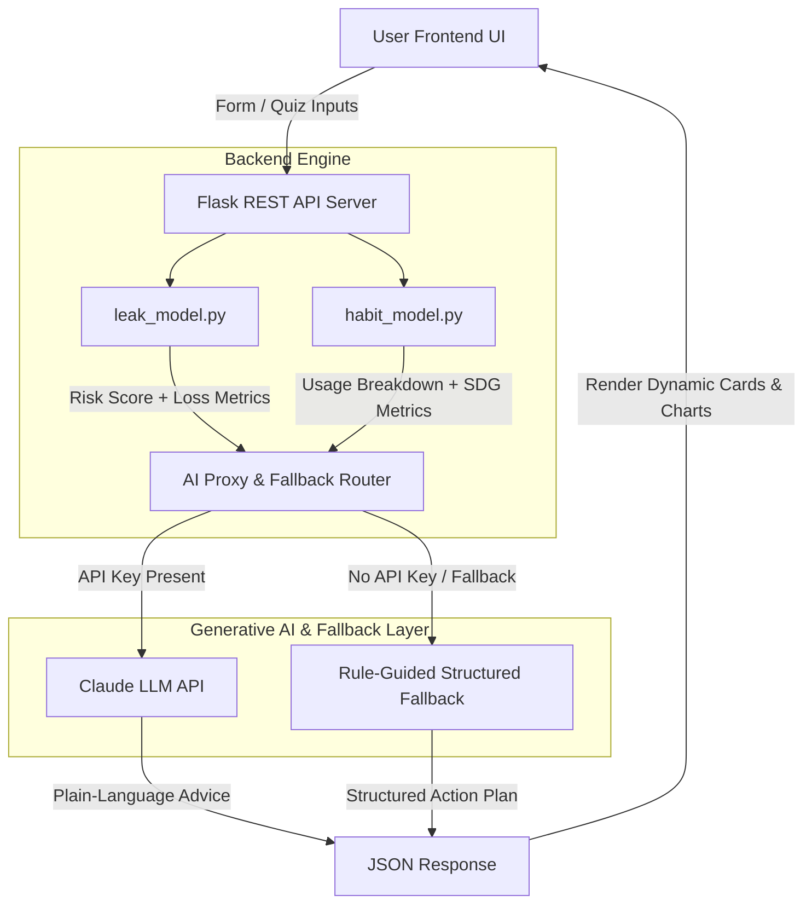

# 💧 Smart Water Usage Advisor

<div align="center">


**An AI-Powered Hybrid Intelligence System for Early Household Leak Detection & Transparent Consumption Benchmark Optimization**

*An AI for Sustainability Solution for Household Conservation & Early Leak Detection*

---

🌐 **Live Production Deployment**: [https://smart-water-usage-advisor.vercel.app](https://smart-water-usage-advisor.vercel.app)

---

[Key Features](#-key-features) • [Why Hybrid AI?](#-why-hybrid-rules--ai-design) • [Architecture](#-system-architecture) • [Algorithms](#-scoring-algorithms--rationales) • [Installation](#-quick-start--installation) • [Responsible AI](#-responsible-ai-framework)

</div>

---

## 🌟 Executive Summary

Urban households rarely detect water leaks until an exorbitant monthly utility bill arrives — by which point thousands of liters have already leaked into walls, sub-floors, or drains. Concurrently, routine domestic water waste (excess shower duration, tap running while scrubbing dishes, half-load laundry runs) goes unmonitored due to a lack of personalized, actionable feedback.

**Smart Water Usage Advisor** solves both challenges using a **Hybrid Intelligence Framework**:
1. **Weighted Multi-Signal Leak Risk Model** — A deterministic mathematical engine evaluating physical indicators (meter drift, bill spikes, dampness, running cisterns) into a normalized **0–100 Leak Risk Score**.
2. **Transparent Habit & Benchmark Advisor** — A per-capita daily usage calculator benchmarking consumption against **UN SDG 6 standards (135 LPD)** and calculating immediate financial & volumetric savings potential.
3. **Context-Aware Generative AI Layer** — Integrates Claude (with intelligent zero-key offline fallbacks) to turn complex numerical breakdowns into empathetic, step-by-step mitigation plans.

---

## 🚀 Key Features

- **🔍 Multi-Signal Leak Risk Assessment**: Evaluates weighted physical indicators with clear severity escalation thresholds (*No Leak*, *Possible Minor*, *Likely Major*, *Critical Multi-Point*).
- **📊 Benchmark Usage Breakdown**: Computes exact monthly water volumes and percentages across household activities (showers, dishwashing, gardening, laundry).
- **🇺🇳 UN SDG 6 Alignment**: Compares household Liters Per Person Per Day (LPD) against the global UN/WHO benchmark target of 135 LPD.
- **💰 Financial & Volumetric Savings Estimator**: Calculates exact monthly water volume savings (Liters/month) and monetary savings ($/month).
- **🛡️ 100% Offline-Capable & Audit-Safe**: Uses rule-guided algorithms so the core scoring, calculations, and structured advice work fully offline even without an LLM API key.
- **⚡ 1-Click Preset Scenario Evaluator**: Includes pre-configured household profiles (*Eco Champion*, *Running Toilet*, *High-Risk Pipe Leak*) for instant live testing.

---

## 🏗️ Why Hybrid (Rules + AI) Design?

> [!IMPORTANT]
> Pure LLMs should **never** be responsible for computing safety-critical metrics or financial risk scores, as they can suffer from hallucination, non-determinism, and lack of auditability.

```
┌──────────────────────────────────────────────┐
│             User Input / Signals             │
└──────────────────────┬───────────────────────┘
                       │
                       ▼
┌──────────────────────────────────────────────┐
│    Deterministic Rule & Mathematical Model   │
│  (leak_model.py  &  habit_model.py)          │
│  • 100% Audit-Safe  • Non-Hallucinating     │
└──────────────────────┬───────────────────────┘
                       │ Calculates numeric score & metrics
                       ▼
┌──────────────────────────────────────────────┐
│        Generative AI Contextual Layer        │
│  (Claude Sonnet API + Smart Offline Engine)  │
│  • Natural Language  • Actionable Guidance  │
└──────────────────────┬───────────────────────┘
                       │ Generates output report
                       ▼
┌──────────────────────────────────────────────┐
│      Structured User Dashboard & Report      │
└──────────────────────────────────────────────┘
```

- **Deterministic Layer (Core Math)**: Guarantees consistent, explainable, and repeatable calculations. The leak score or usage benchmark will be identical every time for the same inputs.
- **Generative AI Layer (Explanation)**: Translates raw data into intuitive, human-friendly guidance, recommending specific plumbing fixes or habit modifications tailored to the user's situation.

---

## 📐 System Architecture



---

## 🧮 Scoring Algorithms & Rationales

### 1. Leak Risk Weighting Rationale (`backend/leak_model.py`)

Rather than arbitrary standard scoring, each self-reported signal is weighted strictly by its empirical correlation with active structural leaks:

| Signal Key | Weight | Est. Daily Loss | Engineering Rationale |
| :--- | :---: | :---: | :--- |
| **`meter_moves`** | **35%** | `200 L/day` | **Strongest Direct Signal**: A moving meter with all household taps closed confirms active, continuous pressurized draw. |
| **`bill_spike`** | **25%** | `450 L/day` | **Strong but Noisy**: Utility bill spikes indicate excess volume, though seasonal variance or visitors can contribute. |
| **`damp_patches`** | **20%** | `120 L/day` | **Physical Lagging Indicator**: Mold or dampness confirms seepage behind walls/floors, typically following prolonged leaks. |
| **`cistern_running`**| **20%** | `700 L/day` | **High Volume Fixture Leak**: Silent flapper valve failure in toilet tanks can waste up to 700+ Liters daily. |

#### Risk Severity Classification
- `0 Points`: **No Leak Detected** (Urgency: Low)
- `1 - 49 Points`: **Possible Minor Leak** (Urgency: Moderate)
- `50 - 74 Points`: **Likely Major Leak** (Urgency: High)
- `75 - 100 Points`: **Critical Multi-Point Leak** (Urgency: Critical)

---

### 2. Habit Usage & UN SDG 6 Benchmark Model (`backend/habit_model.py`)

The habit advisor converts self-reported daily routines into monthly volumetric estimates using standard water flow rate standards:

- **Shower Consumption**: $\text{Shower Minutes} \times 9\text{ L/min} \times 30\text{ Days} \times \text{Household Size}$
- **Dishwashing Tap**: 
  - *Running Tap*: $10\text{ min/day} \times 6\text{ L/min} \times 30\text{ Days} = 1,800\text{ L/month}$
  - *Tap Off*: $2\text{ min/day} \times 6\text{ L/min} \times 30\text{ Days} = 360\text{ L/month}$
- **Garden Irrigation**: $\text{Garden Minutes} \times 15\text{ L/min} \times 30\text{ Days}$
- **Washing Machine**: $65\text{ L/run} \times (\text{Runs/week} \times 4.33\text{ Weeks/month})$

#### Per-Capita LPD Calculation
$$\text{Per-Capita LPD} = \frac{\text{Total Monthly Household Volume (Liters)}}{30 \times \text{Household Members}}$$

> [!NOTE]
> The target benchmark is **135 Liters Per Person Per Day (LPD)**, aligned with UN SDG 6 guidelines for basic domestic water security.

---

## 📁 Project Structure

```
smart-water-usage-advisor/
├── backend/
│   ├── app.py              # Flask REST API, static server & AI proxy routing
│   ├── leak_model.py       # Weighted multi-signal leak algorithm & risk scorer
│   ├── habit_model.py      # Water usage breakdown estimator & SDG 6 benchmark engine
│   └── test_models.py      # Automated pytest unit test suite (11 test cases)
├── frontend/
│   ├── templates/
│   │   └── index.html      # Responsive dashboard UI (HTML5, Accessible Design)
│   └── static/
│       ├── style.css       # Premium CSS design system (Glassmorphic theme, CSS grid/flex)
│       └── app.js          # Interactive frontend logic & API client handlers
├── LICENSE                 # MIT Open Source License
├── requirements.txt        # Python package dependencies (Flask, anthropic, pytest)
└── README.md               # Complete project documentation & developer guide
```

---

## 🛠️ Quick Start & Installation

### Prerequisites
- **Python 3.9+** installed on your system.
- Git.

### 1. Clone the Repository
```bash
git clone https://github.com/nevilusdad777/smart-water-usage-advisor.git
cd smart-water-usage-advisor
```

### 2. Install Dependencies
```bash
pip install -r requirements.txt
```

### 3. Set Up Environment Variables (Optional)
To enable live Anthropic Claude LLM explanations, set your API key:
```bash
# On Linux/macOS
export ANTHROPIC_API_KEY=your_anthropic_api_key_here

# On Windows (PowerShell)
$env:ANTHROPIC_API_KEY="your_anthropic_api_key_here"
```
> *Note: If no API key is provided, the application runs seamlessly using built-in, structured, professional fallback insights!*

### 4. Launch the Application
```bash
python backend/app.py
```
Open **`http://localhost:5000`** in your browser to view the interactive application dashboard.

---

## 🧪 Automated Testing

The project includes unit tests verifying both the scoring logic and edge cases across leak scenarios and habit estimations.

Run tests using `pytest`:

```bash
py -m pytest backend/test_models.py -v
```

#### Test Suite Coverage:
- `test_no_signals_means_no_leak`: Verifies baseline zero-score logic.
- `test_single_meter_signal_is_minor`: Verifies 35-point meter score classification.
- `test_all_signals_is_critical`: Verifies multi-point leak aggregation (100 points, 44,100 L/mo loss).
- `test_meter_plus_one_other_escalates_to_major`: Tests threshold escalation to Major Leak.
- `test_shower_only_calculation_scaled_by_household`: Verifies per-capita household scaling.
- `test_sdg_benchmark_comparison_and_savings`: Validates SDG 6 target percentage comparisons.

---

## ⚖️ Responsible AI Framework

This project adheres to strict Responsible AI guidelines:

- **🔒 Transparency & Explainability**: Every calculation is strictly mathematical and open-source. The AI layer *explains* numbers; it never invents them.
- **⚖️ Fairness & Accessibility**: Benchmark figures are based on WHO/UN standards without demographic bias. All assumptions are explicitly declared to the user.
- **🛡️ Ethics & Safety**: The system provides advisory guidance only, recommending certified plumbers for major risks, preventing dangerous self-repairs.
- **🔐 Privacy & Data Minimization**: Zero Personally Identifiable Information (PII) is requested or stored. All assessments process transiently in memory.

---

## 📊 Tested Scenarios Summary Matrix

| Scenario Profile | Meter Moves | Bill Spike | Damp Patches | Cistern Running | Risk Score | Status Flag | Est. Monthly Loss |
| :--- | :---: | :---: | :---: | :---: | :---: | :--- | :---: |
| **🌱 Eco Champion** | ❌ | ❌ | ❌ | ❌ | **0 / 100** | `No Leak Detected` | `0 Liters` |
| **🚽 Running Toilet** | ❌ | ❌ | ❌ | ✅ | **20 / 100** | `Possible Minor Leak` | `21,000 Liters` |
| **⚠️ Meter + Bill Spike** | ✅ | ✅ | ❌ | ❌ | **60 / 100** | `Likely Major Leak` | `19,500 Liters` |
| **🚨 Multi-Point Burst**| ✅ | ✅ | ✅ | ✅ | **100 / 100** | `Critical Multi-Point Leak` | `44,100 Liters` |

---

## 🔮 Future Roadmap

- [ ] **IoT Smart Meter Telemetry Integration**: Real-time MQTT stream consumption analysis.
- [ ] **Localized Water Tariff Engines**: Regional water utility pricing calculations per municipality.
- [ ] **Multilingual Support**: Support for regional Indian languages (Hindi, Kannada, Tamil, Marathi).
- [ ] **Community Housing Dashboard**: Aggregated anonymized reporting for apartment complexes.

---

## 👤 Author & Acknowledgments

**Nevil Usdad**  
*JAIN (Deemed-to-be University)*  
Developed for AI for Sustainability Project Initiative

---

## 📜 License

This project is licensed under the **MIT License** — see the [LICENSE](LICENSE) file for details.
